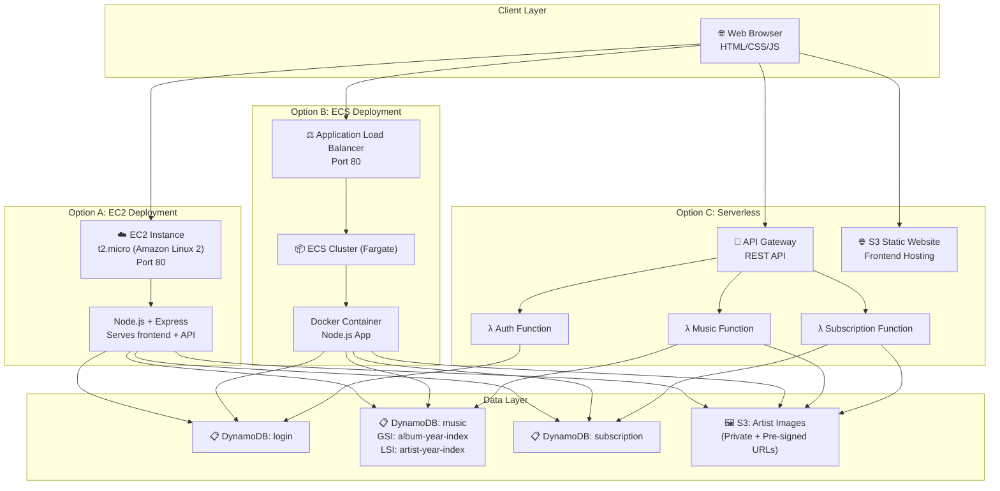

# 🏗️ AWS Architecture & Deployment Guide

## Architecture Diagram



---

## DynamoDB Schema Design Explained

### Why This Design?

| Table | PK | SK | Rationale |
|-------|----|----|-----------|
| `login` | `email` | — | Email is the unique identifier; simple lookups by email |
| `music` | `artist` | `title` | Groups songs by artist (efficient query); title ensures uniqueness per artist |
| `subscription` | `email` | `song_id` | Groups all subscriptions per user; song_id (artist#title) ensures uniqueness |

### Index Design

**LSI: `artist-year-index`** (music table)
- Same PK as base: `artist`
- SK: `year`
- Use case: "Show me all songs by The Weeknd, sorted by year"
- LSI must be defined at table creation time

**GSI: `album-year-index`** (music table)
- PK: `album`
- SK: `year`
- Use case: "Show me all songs from album 'After Hours'" — different access pattern from the base table

---

## 🖥️ OPTION A: EC2 Deployment

### Step 1: Launch EC2 Instance

```bash
# In AWS Console:
# 1. Go to EC2 → Launch Instance
# 2. Settings:
#    - Name: music-subscription-app
#    - AMI: Amazon Linux 2023
#    - Instance type: t2.micro (free tier)
#    - Key pair: Create or select existing
#    - Security Group: Allow HTTP (80), SSH (22)
#    - IAM Role: LabRole
# 3. Launch
```

### Step 2: Connect & Install Dependencies

```bash
# SSH into your instance
ssh -i your-key.pem ec2-user@<PUBLIC_IP>

# Update system
sudo yum update -y

# Install Node.js 20
curl -fsSL https://rpm.nodesource.com/setup_20.x | sudo bash -
sudo yum install -y nodejs

# Install Git
sudo yum install -y git

# Verify
node --version    # v20.x
npm --version     # 10.x
```

### Step 3: Deploy Application

```bash
# Clone or upload your project
# Option 1: Git clone (if you pushed to GitHub)
git clone https://github.com/YOUR_REPO/music-subscription-app.git
cd music-subscription-app

# Option 2: Use SCP to upload
# (from your local machine)
scp -i your-key.pem -r ./music-subscription-app ec2-user@<PUBLIC_IP>:~/

# Install dependencies
cd ~/music-subscription-app/backend
npm install

# Create .env file
cat > .env << 'EOF'
AWS_REGION=us-east-1
S3_BUCKET_NAME=music-app-artist-images-YOUR_ID
JWT_SECRET=your-super-secret-key
PORT=80
NODE_ENV=production
EOF

# Run setup scripts (create tables, load data, upload images)
node scripts/createTables.js
node scripts/loadMusicData.js
node scripts/uploadImages.js
node scripts/seedLoginData.js
```

### Step 4: Run on Port 80

```bash
# Port 80 requires elevated privileges
# Option 1: Use sudo directly
sudo PORT=80 node server.js

# Option 2: Use iptables redirect (recommended)
sudo iptables -t nat -A PREROUTING -p tcp --dport 80 -j REDIRECT --to-port 3000
PORT=3000 node server.js

# Option 3: Use PM2 for production (auto-restart)
sudo npm install -g pm2
sudo PORT=80 pm2 start server.js --name music-app
sudo pm2 startup
sudo pm2 save
```

### Step 5: Access the App

Open browser → `http://<EC2_PUBLIC_IP>`

---

## 📦 OPTION B: ECS Deployment

### Step 1: Create ECR Repository & Push Docker Image

```bash
# On your LOCAL machine (or EC2 with Docker installed)

# Authenticate Docker with ECR
aws ecr get-login-password --region us-east-1 | \
  docker login --username AWS --password-stdin <ACCOUNT_ID>.dkr.ecr.us-east-1.amazonaws.com

# Create ECR repository
aws ecr create-repository --repository-name music-subscription-app --region us-east-1

# Build Docker image (from project root where Dockerfile is)
docker build -t music-subscription-app .

# Tag for ECR
docker tag music-subscription-app:latest \
  <ACCOUNT_ID>.dkr.ecr.us-east-1.amazonaws.com/music-subscription-app:latest

# Push to ECR
docker push <ACCOUNT_ID>.dkr.ecr.us-east-1.amazonaws.com/music-subscription-app:latest
```

### Step 2: Create ECS Cluster (Fargate)

```bash
# Via AWS Console:
# 1. Go to ECS → Create Cluster
# 2. Cluster name: music-app-cluster
# 3. Infrastructure: AWS Fargate
# 4. Create

# Or via CLI:
aws ecs create-cluster --cluster-name music-app-cluster
```

### Step 3: Create Task Definition

```json
{
  "family": "music-app-task",
  "networkMode": "awsvpc",
  "requiresCompatibilities": ["FARGATE"],
  "cpu": "256",
  "memory": "512",
  "executionRoleArn": "arn:aws:iam::<ACCOUNT_ID>:role/LabRole",
  "taskRoleArn": "arn:aws:iam::<ACCOUNT_ID>:role/LabRole",
  "containerDefinitions": [
    {
      "name": "music-app",
      "image": "<ACCOUNT_ID>.dkr.ecr.us-east-1.amazonaws.com/music-subscription-app:latest",
      "portMappings": [
        {
          "containerPort": 80,
          "protocol": "tcp"
        }
      ],
      "environment": [
        { "name": "AWS_REGION", "value": "us-east-1" },
        { "name": "S3_BUCKET_NAME", "value": "music-app-artist-images-YOUR_ID" },
        { "name": "JWT_SECRET", "value": "your-secret-key" },
        { "name": "PORT", "value": "80" },
        { "name": "NODE_ENV", "value": "production" }
      ],
      "logConfiguration": {
        "logDriver": "awslogs",
        "options": {
          "awslogs-group": "/ecs/music-app",
          "awslogs-region": "us-east-1",
          "awslogs-stream-prefix": "ecs"
        }
      },
      "essential": true
    }
  ]
}
```

```bash
# Register task definition
aws ecs register-task-definition --cli-input-json file://task-definition.json
```

### Step 4: Create Service with ALB

```bash
# Create Application Load Balancer (via Console)
# 1. EC2 → Load Balancers → Create
# 2. Type: Application Load Balancer
# 3. Name: music-app-alb
# 4. Scheme: Internet-facing
# 5. Listener: HTTP:80
# 6. Target Group: music-app-tg (IP targets, port 80, health check: /api/health)

# Create ECS Service
aws ecs create-service \
  --cluster music-app-cluster \
  --service-name music-app-service \
  --task-definition music-app-task \
  --desired-count 1 \
  --launch-type FARGATE \
  --network-configuration "awsvpcConfiguration={subnets=[subnet-xxx],securityGroups=[sg-xxx],assignPublicIp=ENABLED}" \
  --load-balancers "targetGroupArn=arn:aws:elasticloadbalancing:...,containerName=music-app,containerPort=80"
```

### Step 5: Access the App

Open browser → `http://<ALB_DNS_NAME>`

---

## ⚡ OPTION C: Serverless (API Gateway + Lambda)

### Step 1: Create Lambda Functions

```bash
# For each function (auth, music, subscription):

# 1. Create a deployment package
cd lambda/auth
zip -r auth-function.zip index.mjs

# 2. Create the Lambda function
aws lambda create-function \
  --function-name music-app-auth \
  --runtime nodejs20.x \
  --handler index.handler \
  --role arn:aws:iam::<ACCOUNT_ID>:role/LabRole \
  --zip-file fileb://auth-function.zip \
  --environment Variables="{JWT_SECRET=your-secret,AWS_REGION=us-east-1,S3_BUCKET_NAME=music-app-artist-images-YOUR_ID}" \
  --timeout 30 \
  --memory-size 256

# Repeat for music and subscription functions
```

### Step 2: Create API Gateway

```bash
# Via AWS Console → API Gateway → Create REST API

# Create resources and methods:
# /auth
#   /login      → POST → Lambda: music-app-auth
#   /register   → POST → Lambda: music-app-auth
#   /logout     → POST → Lambda: music-app-auth
# /music
#   /search     → GET  → Lambda: music-app-music
# /subscriptions
#                → GET  → Lambda: music-app-subscription
#                → POST → Lambda: music-app-subscription
#                → DELETE → Lambda: music-app-subscription

# Enable CORS on each resource
# Deploy API to a stage (e.g., "prod")
```

### Step 3: Host Frontend on S3

```bash
# Create S3 bucket for frontend
aws s3 mb s3://music-app-frontend-YOUR_ID

# Enable static website hosting
aws s3 website s3://music-app-frontend-YOUR_ID \
  --index-document index.html

# Upload frontend files
aws s3 sync frontend/ s3://music-app-frontend-YOUR_ID/ \
  --acl public-read

# IMPORTANT: Update api.js BASE_URL to your API Gateway URL
# const BASE_URL = 'https://xxxxx.execute-api.us-east-1.amazonaws.com/prod';
```

### Step 4: Access the App

Open browser → `http://music-app-frontend-YOUR_ID.s3-website-us-east-1.amazonaws.com`

---

## 📊 Architecture Comparison

### Frontend Hosting Choice: EC2

We chose to host the frontend on the **same EC2 instance** as the backend because:
1. **Simplicity** — Single deployment, no CORS issues
2. **Academic scope** — Demonstrates EC2 capabilities fully
3. **Cost** — Single t2.micro instance (free tier eligible)

For production, **S3 + CloudFront** would be superior (CDN caching, HTTPS, global distribution).

### Backend Architecture Comparison

| Criteria | EC2 | ECS (Fargate) | Lambda + API Gateway |
|----------|-----|---------------|---------------------|
| **Setup Complexity** | Low — SSH + npm | Medium — Docker + task defs | Medium — function packaging |
| **Cost** | ~$8.50/mo (t2.micro) | ~$15/mo (0.25 vCPU, 512MB) | ~$0.03/mo (pay per request) |
| **Auto-Scaling** | Manual (need ASG) | Built-in (ECS service) | Fully automatic |
| **Cold Starts** | None | None | 100-500ms possible |
| **Maintenance** | High (OS updates, patches) | Medium (container updates) | Low (AWS managed) |
| **Max Concurrency** | Limited by instance | Scales with tasks | 1000 concurrent (default) |
| **Best For** | Full control, legacy apps | Microservices, consistent load | Sporadic traffic, event-driven |

### Recommendation

> **For this academic project**: **Lambda + API Gateway** is the best choice.
> - **Cost**: Nearly free for low-traffic academic use
> - **Scalability**: Handles 0 to 1000 concurrent requests automatically
> - **Maintenance**: Zero server management
> - **Performance**: Acceptable for this use case (cold starts are negligible with provisioned concurrency)

> **For a real production app** with consistent traffic: **ECS Fargate** would be ideal — predictable performance, container-based deployment, and reasonable cost with auto-scaling.

---

## Security Best Practices Implemented

1. **S3 Bucket**: Public access blocked; images served via pre-signed URLs
2. **Passwords**: Hashed with bcrypt (10 salt rounds)
3. **Authentication**: JWT tokens with 24-hour expiry
4. **Input Validation**: All inputs validated before DynamoDB operations
5. **No Data Overwrite**: `ConditionExpression` on all PutItem operations
6. **CORS**: Configured (restrict origin in production)
7. **Helmet.js**: Security headers on Express
8. **IAM**: Using LabRole with least-privilege access where possible
